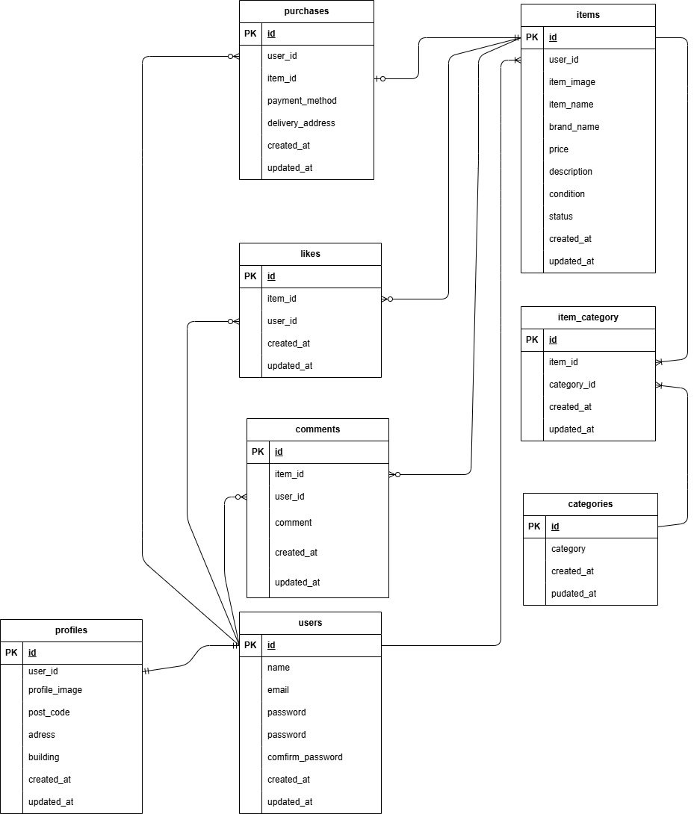

# README.md

# 模擬テスト フリマアプリ

# プロジェクト名: frea-market

GitHubリポジトリURL: [git@github.com:oxnut134/frea-market.git](mailto:git@github.com:oxnut134/frea-market.git)

---

# 1）環境構築

### 1-1 開発環境

### 必要ファイル作成

- **ディレクトリ構築**
- **以下のファイルを作成**
    - docker-compose.yml
    - default.conf
    - Dockerfile
    - php.ini
    - my.cnf

### Dockerビルド

```css
コピー
docker-compose up -d --build

```

### PHPコンテナログイン

```bash

docker-compose exec php bash

```

### Composerインストール確認

```

composer -v

```

### Laravelインストール

```lua

composer create-project "laravel/laravel=8.*" . --prefer-dist

```

### 日本時間に変更

`config/app.php　　'timezone' => 'Asia/Tokyo'`

### Laravel起動確認

- ブラウザで `http://localhost` にアクセス

### エラー発生時の対応

```jsx
chmod -R 775 storage
chown -R www-data storage
```

---

### 1-2 Database

### MySQLコンテナログイン

```bash
コピー
docker-compose exec mysql bash

```

### MySQL起動

```css
コピー
mysql -u laravel_user -p

```

- **パスワード入力**

### Database確認

```
コピー
show databases;

```

### `.env`ファイル編集

```
コピー
DB_CONNECTION=mysql
DB_HOST=mysql
DB_PORT=3306
DB_DATABASE=laravel_db
DB_USERNAME=laravel_user
DB_PASSWORD=laravel_pass

```

---

### 1-3 マイグレーション

### マイグレーション実行

```
コピー
php artisan migrate

```

### 実行順（参考）

1. **2014_09_30_000001_create_users_table.php**→ 2019年に隠れファイルが存在し、`migrate`で`users`テーブルがないとエラーが発生するため、2014年の日付に変更。
2. **2025_07_08_000104_create_items_table.php**
3. **2025_07_08_000108_create_categories_table.php**
4. **2025_07_08_000112_create_profiles_table.php**
5. **2025_07_08_000120_create_likes_table.php**
6. **2025_07_08_000124_create_comments_table.php**
7. **2025_07_08_000140_create_item_category_table.php**
8. **2025_07_09_073407_create_add_nullable_brand_building_table.php**→ 上書き用
9. **2025_07_09_073410_create_add_nullable_status_table.php**→ 上書き用
10. **2025_07_09_073420_create_purchases_table.php**

---

### 1-4 シーディング

### シーディング実行

```
コピー
php artisan db:seed

```

### 実行対象

- **ItemsTableSeeder**
- **CategoriesTableSeeder**

### 画像の公開リンク作成

商品画像・プロフィール画像は `storage/app/public` に保存されます（シード画像もシーディング時にここへコピーされます）。
シーディングの後、php コンテナ内で一度だけ次の 2 つを実行してください。

```
docker compose exec php php artisan storage:link
docker compose exec php chown -R www-data:www-data storage/app/public
```

- `storage:link`：ブラウザから画像を表示できるように `public/storage` のリンクを作成します。
- `chown`：シーディング（root で実行）が作ったディレクトリに、アプリ（www-data）からアップロード画像を書き込めるようにします。実行しないと画像のアップロードが 500 エラーになります。

- 保存先のディスクは `.env` の `IMAGE_DISK` で切り替えます（ローカル：`public`、本番：`s3`）。
- 画像アップロードの上限は 5MB です。`docker/php/php.ini` を変更した場合は `docker compose build php && docker compose up -d php` で再ビルドしてください。

---

### 1-5 Mailhog設定

### `.env`ファイル編集

```
コピー
MAIL_MAILER=smtp
MAIL_HOST=mailhog
MAIL_PORT=1025
MAIL_USERNAME=null
MAIL_PASSWORD=null
MAIL_ENCRYPTION=null
MAIL_FROM_ADDRESS=admin@test.com
MAIL_FROM_NAME="${APP_NAME}"

```

---

### 1-6 Stripe設定

### `.env`ファイル編集

```
コピー
STRIPE_PUBLIC_KEY={公開可能キー}
STRIPE_SECRET_KEY={シークレットキー}
STRIPE_WEBHOOK_SECRET={Webhook の署名シークレット（whsec_...）}

```

- キーはテストモードのもの（`pk_test_...` / `sk_test_...`）を使います。
- `STRIPE_WEBHOOK_SECRET` は、下の「ローカルで Webhook を受け取る」で表示される値です。

### `config/services.php`に追記

```bash
コピー
'stripe' => [
    'public_key' => env('STRIPE_PUBLIC_KEY'),
    'secret_key' => env('STRIPE_SECRET_KEY'),
],

```

### 決済の流れ

- 「購入する」を押すと商品を確保し、Stripe の決済画面（Checkout）へ進みます。
- 購入の確定は、Stripe から届く Webhook（`POST /stripe/webhook`）で行います。Webhook が届かないと、購入は「取引中」のまま完了しません。
- Laravel Cashier は使いません（インストール不要）。

### ローカルで Webhook を受け取る（Stripe CLI）

Stripe からローカルの環境には直接届かないので、[Stripe CLI](https://docs.stripe.com/stripe-cli) で転送します。ホスト側（コンテナの外）で実行してください。

1. Stripe にログインします（ブラウザで認証）。

```
stripe login
```

2. Webhook をローカルへ転送します。確認の間は実行したままにします。

```
stripe listen --forward-to http://localhost/stripe/webhook
```

3. 起動時に表示される `whsec_...` を、`.env` の `STRIPE_WEBHOOK_SECRET` に設定します。

4. 設定を読み直します。

```
docker compose exec php php artisan config:clear
```

- `STRIPE_WEBHOOK_SECRET` が未設定、または値が違う場合、Webhook はすべて 400（署名エラー）になります。
- 転送されたイベントと応答コードは `stripe listen` の画面に表示されます。アプリ側のログは `storage/logs/laravel.log` です。

### Stripe ダッシュボードの設定

- **コンビニ決済の有効化**：ダッシュボードの「設定 → 決済手段」でコンビニ決済を有効にします。無効のままだと、コンビニ払いを選んだときに決済を開始できません。
- **Webhook の API バージョン**：本番などでダッシュボードに Webhook エンドポイント（`https://{ドメイン}/stripe/webhook`）を登録するときは、API バージョンを `2026-08-26.dahlia` にします（stripe-php 21.3 が対応するバージョン）。
- **受信するイベント**：`checkout.session.completed`、`checkout.session.async_payment_succeeded`、`checkout.session.async_payment_failed`、`checkout.session.expired`。

### テスト用の入力

- カード払い：カード番号 `4242 4242 4242 4242`、有効期限は未来の日付、セキュリティコードは任意。
- コンビニ払い：決済画面の確認番号に次の値を入れると、結果を切り替えられます。

| 確認番号 | 結果 |
| --- | --- |
| `22222222220` | すぐに入金される（SOLD になる） |
| `11111111110` | 3 分後に入金される（その間は「取引中」） |
| `33333333330` | すぐに期限切れになる（販売中に戻る） |

---

### テストコード

**①会員登録機能　　　　RegisterValidationTest.php
②ログイン機能　　　　LoginValidationTest.php**
③**ログアウト機能　　　LogoutValidationTest.php
④商品一覧取得　　　　IndexFunctionTest.php
⑤マイリスト一覧取得　MylistFunctionTest.php
⑥商品検索機能　　　　SearchItemsTest.php
⑦商品詳細情報取得　　ShowItemDetailTest.php
⑧いいね機能　　　　　LikeFunctionTest.php
⑨コメント送信機能　　CommentFunctionTest.php
⑩商品購入機能　　　　PurchaseFunctionTest.php
⑪支払い方法選択機能　PaymentMethodDisplayedTest.php
⑫配送先変更機能　　　RedirectDeliveryAddressTest.php
⑬ユーザー情報取得　　MyPageFunctionTest.php
⑭ユーザー情報変更　　MyProfileDisplayedTest.php
⑮出品商品情報登録　　RegisterForExhibitionTest.php**

# 2）利用技術

- **Docker**: 27.5.1
- **PHP**: 7.4.9
- **MySQL**: 8.0.26
- **Nginx**: 1.21.1
- **phpMyAdmin**
- **Laravel Framework**: 8.75
- **Laravel Fortify**: 1.19
- **Mailhog**: latest
- **Stripe/stripe-php**: 9.9

---

# 3）ER図



---

# 4）URL

- **開発環境**: [http://localhost/](http://localhost/)
- **Laravel公式ドキュメント**: [Laravel Fortify - Laravel 12.x](https://laravel.com/docs/12.x/fortify)
- **Mailhog**: [https://github.com/mailhog/MailHog](https://github.com/mailhog/MailHog)
- **Stripe公式サイト**: [https://stripe.com/jp](https://stripe.com/jp)
- **Stripe Checkout作成例**: [https://zakkuri.life/laravel-stripe-charge/](https://zakkuri.life/laravel-stripe-charge/)※APIが以前のもので3DS未対応のため、新しいAPIにする必要あり。

# 5）追記事項

## 認証メール　確認操作

今回のメール認証は会員登録後、mailhogでユーザーにメールが送信され、そのメールの

「メールアドレス確認」ボタンをクリックすることでusersテーブルのemail_verified_atカラムに
日時が保存されて完了します。以下操作手順を記述します。

①会員登録画面　「登録する」ボタンクリック

②認証メール送付案内表示

　　ここで送信側はユーザーの確認操作待ちとなります。


③mailhog画面立ち上げ（事前立ち上げでもOKです。）

　http://localhost:8025


④対応するメール行クリックでメール内容表示


⑤「メールアドレス確認」ボタンクリックで認証完了です。

認証後はプロフィール登録画面へ遷移します。

※今回の流れでは、送信されたメールの確認ボタンをクリックしないと、usersテーブルのカラム（email_verified_at)にデータが保存されずに未認証のままとなり、一方ではメールアドレスは登録されていますので、再度の登録はできなくなり、そのメールアドレスは使用できなくなります。現状では、未認証ユーザーのレコードは直接テーブルを操作し手動で削除しています。"# pro-test" 

## 依存パッケージの脆弱性

`composer audit` で報告された 41 件（12 パッケージ）のうち、36 件はパッケージの更新で解消しました。
残る 5 件は、修正版が Laravel 9 以上にしかないため、Laravel 8 のままでは解消できません。
Laravel のメジャーアップグレードは今回の範囲外とし、このアプリで影響するかを確認したうえで残しています。

確認コマンド：`docker compose exec php composer audit`
（残した 5 件は「ignored」として、理由とともに表示されます。設定は `src/composer.json` の `config.policy.advisories.ignore-id`）

### 残している勧告

| 勧告 | 重大度 | 修正版 | このアプリでの影響 |
|---|---|---|---|
| [GHSA-5vg9-5847-vvmq](https://github.com/advisories/GHSA-5vg9-5847-vvmq) email ルールの CRLF インジェクション | high | Laravel 12.60 | 条件付きであり（下記） |
| [GHSA-crmm-hgp2-wgrp](https://github.com/advisories/GHSA-crmm-hgp2-wgrp) 一時署名 URL のパス混同 | medium | Laravel 12.61.1 | なし。ローカルディスクの一時 URL（`Storage::temporaryUrl`）を使っておらず、Laravel 8 にこの機能がない |
| [GHSA-78fx-h6xr-vch4](https://github.com/advisories/GHSA-78fx-h6xr-vch4) ファイル検証の回避（CVE-2025-27515） | medium | Laravel 10.48.29 | なし。ワイルドカード（`files.*`）での検証を使っておらず、画像は単一フィールドで検証している |
| [GHSA-jh5r-qr3c-85q8](https://github.com/advisories/GHSA-jh5r-qr3c-85q8) デバッグ画面の XSS（CVE-2026-102279） | low | Laravel 12.69 | なし。`APP_DEBUG=true` のときだけ成立し、本番は `false` |
| [GHSA-cxf4-7mrp-vvpr](https://github.com/advisories/GHSA-cxf4-7mrp-vvpr) flysystem のパス正規化（CVE-2026-102601） | low | flysystem 3.35.3（Laravel 9 以上） | なし。保存先は固定ディレクトリとランダムなファイル名で、利用者はパスを指定できない |

### 残る high（email ルールの CRLF インジェクション）について

会員登録では、入力されたメールアドレスに認証メールを送るため、勧告の前提に当てはまります。
Laravel 8 の `email` ルールは、引用符の中の改行など、一部の制御文字を含むアドレスを通します。

緩和策として、登録時にメールアドレスの制御文字（改行、タブ、NUL など）を弾く検証を足しています
（`app/Actions/Fortify/CreateNewUser.php`、テストは `tests/Feature/RegisterEmailControlCharactersTest.php`）。

これは緩和策で、修正ではありません。

- 勧告は具体的な入力を公開していないため、この検証で塞げるとは断定できません
- 勧告は Symfony Mailer との組み合わせを条件にしています。Laravel 8 のメール送信は SwiftMailer で、同じ経路が成立するかは確認できていません
- 本番は `MAIL_MAILER=log` で、メールを SMTP に送っていません

**本番で SMTP に切り替えるときは、この勧告を再確認してください。** 実際にメールが外部へ送られるようになり、上の前提が変わります。

### 放棄されたパッケージ

`composer audit` は、次の 2 つを「放棄されたパッケージ」として報告し、終了コードが 1 になります。
どちらも Laravel 9 以上で不要になるもので、Laravel 8 では置き換えられないため、設定は変えていません。

- `fruitcake/laravel-cors`（Laravel 9 でフレームワークに統合）
- `swiftmailer/swiftmailer`（Laravel 9 で Symfony Mailer に置き換え）

### 依存を更新するときの注意

`composer update` は、勧告のある版を候補から外します。上の 5 件を `ignore-id` から外すと、Laravel 8 が候補に残らず、更新できなくなります。
新しい勧告が出たときは、影響を確認してから、理由を添えて `ignore-id` に足してください。
