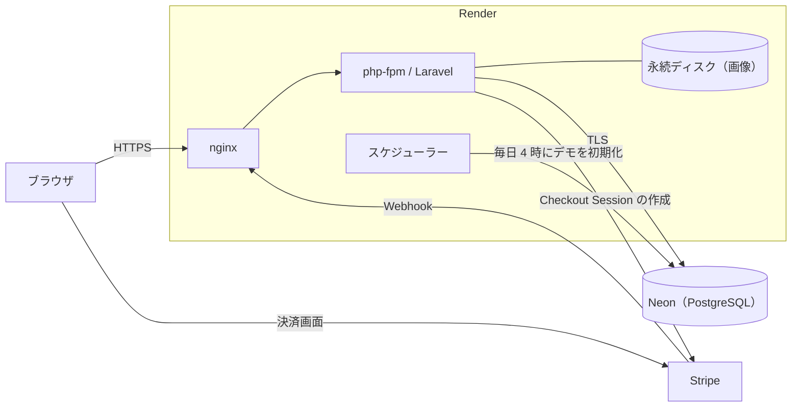
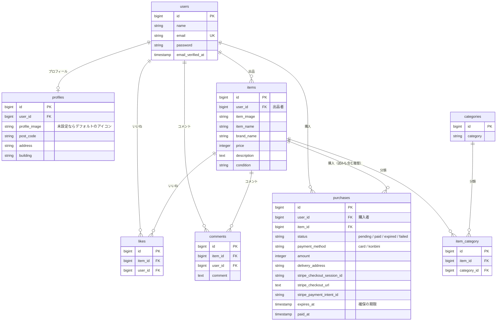

# frea-market

フリマアプリです。出品、検索、いいね、コメント、Stripe での購入（カード払い・コンビニ払い）ができます。

COACHTECH の模擬案件として仕様書に沿って作ったものを土台に、ポートフォリオとして、決済・セキュリティ・運用まわりを作り直しました。

## デモ

**https://frea-market.onrender.com**

1. 「デモアカウントでログイン」を押します（入力は不要です）。
2. 商品を選び、「購入手続きへ」から支払い方法を選んで購入します。
3. Stripe の決済画面で、テスト用のカード番号 `4242 4242 4242 4242` を入力します（有効期限は未来の日付、セキュリティコードは任意）。
4. 決済が終わると、商品に「SOLD」と表示されます。

- 実際の請求は発生しません（Stripe のテストモードです）。
- デモのデータは毎日 4:00 に初期化されます。購入した商品は販売中に戻り、会員登録したアカウントは削除されます。
- 会員登録して試すこともできます。認証メールは送信しないので、架空のメールアドレス（例：yourname@example.com）と、普段使っていないパスワードで登録してください。
- 購入すると、登録したメールアドレスが Stripe のテスト環境に記録されます。
- しばらくアクセスがないと、最初の表示に数秒かかります（データベースが停止状態から起動するためです）。
- コンビニ払いを試す場合の入力は、[テスト用の入力](#テスト用の入力)を見てください。

<!-- スクリーンショット（商品一覧、商品詳細）をここに入れる -->

## 主な機能

| 機能 | 内容 |
|---|---|
| 会員登録・ログイン | Laravel Fortify。メール認証を済ませ、プロフィールを登録すると利用できます |
| 商品一覧・検索 | 商品名での検索、いいねした商品だけのマイリスト |
| 商品詳細 | カテゴリー、状態、いいね、コメント |
| 出品 | 画像（jpeg / png、5MB まで）、カテゴリー、状態、価格 |
| 購入 | Stripe Checkout（カード払い・コンビニ払い）。配送先の変更 |
| 販売状況の表示 | 支払い済みは「SOLD」、支払い待ちは「取引中」 |
| マイページ | 出品した商品、購入した商品、プロフィールの変更 |

## 技術構成

| 種類 | 内容 |
|---|---|
| 言語・フレームワーク | PHP 8.1、Laravel 8.83、Laravel Fortify 1.19 |
| データベース | PostgreSQL 15 |
| 決済 | Stripe Checkout、stripe-php 21.3 |
| テスト | PHPUnit 9.6 |
| ローカル環境 | Docker Compose（nginx 1.21、php-fpm、PostgreSQL、MailHog、Adminer） |
| 本番環境 | Render（Docker、永続ディスク）、Neon（PostgreSQL） |



## 工夫した点・改善した点

### 決済を Checkout と Webhook に作り直した

元は Laravel Cashier を入れていましたが、使っておらず、署名を検証しない Webhook の入口だけが開いた状態でした。Cashier を外し、Stripe Checkout に一本化しました。

- 購入の確定は、Stripe から届く Webhook で行います。決済画面から戻ってこなかった場合や、あとから入金されるコンビニ払いでも、確定が漏れません。
- Webhook は署名を検証し、不正なものは 400 で拒否します。
- 金額はリクエストから受け取らず、商品の価格から決めます。
- Stripe とのやり取りは `app/Services/Stripe/` にまとめ、テストでは Stripe に接続しません。

### 同時に購入されても、二重に売れないようにした

- 「購入する」を押した時点で商品を確保します。確保は 30 分（コンビニ払いは支払期限まで）で切れ、販売中に戻ります。
- 同じ商品の有効な購入は 1 件だけ、という制約を、PostgreSQL の部分ユニークインデックスで表しています。2 人が同時に押しても、片方は DB に弾かれ、「他の方が購入手続き中です」と表示されます。
- Webhook での状態の更新は、「確保中のものだけ」という条件を付けた UPDATE です。同じ通知が重複して届いても、二重には更新されません。
- どの書き込みも 1 文で完結するようにして、トランザクションなしで整合性を保っています。

### 同じ事実を 2 か所に持たないようにした

- 商品の販売状況は、`items` に列として持たず、`purchases` の状態から判定します。確保が期限切れになれば、何も更新しなくても販売中に戻ります。
- いいね数も、`items` に持っていた件数の列をやめて、`likes` から数えます。ユーザーの削除などで件数がずれる経路がなくなりました。

### いいねの不具合を直した

- 追加と削除が GET で、CSRF の検証がかかっていませんでした。リンクを踏ませるだけで操作できたので、POST / DELETE に変えました。
- 連打すると 500 エラーになっていました。追加を `ON CONFLICT DO NOTHING` の 1 文にして、同時に届いてもエラーにならないようにしました。
- アイコンが「自分がいいねしたか」ではなく「いいね数が 0 か」で切り替わっていたのを直しました。

### 依存パッケージの脆弱性に対応した

`composer audit` が報告した 41 件のうち、36 件をパッケージの更新で解消しました。残る 5 件は Laravel 9 以上でしか直らないため、このアプリで影響するかを 1 件ずつ確かめ、理由を記録して残しています（[依存パッケージの脆弱性](#依存パッケージの脆弱性)）。

### デモ環境を用意した

- デモアカウントを 1 つ用意し、ログイン画面のボタンからログインできます。普段と同じログインの処理を通していて、専用の入口は作っていません。
- 会員登録もできます。デモ環境ではメールを送らないので、メール認証を省いてすぐ使えるようにしています。
- 登録を開放した代わりに、歯止めを入れています。同じ IP アドレスからの登録は 1 時間に 5 回まで、登録できる人数は 100 人まで、出品は 1 アカウント 5 件まで（デモアカウントは 20 件まで）です。
- シードのユーザー（パスワードがリポジトリで公開されています）は、デモ環境ではログインできません。
- デモアカウントの購入・いいね・コメント・出品は、毎日 4:00 とデプロイのたびに初期状態へ戻します。デモ環境で登録したアカウントは、データごと削除します。支払い待ちの購入だけは、あとから入金の通知が届くので残します。
- 削除する対象は、登録のときに付けた印（`users.registered_in_demo`）で決めます。メールアドレスなどからの推測では決めないので、設定を誤っても、印のないユーザーは消えません。

### 本番で止まりにくいようにした

- ヘルスチェックは、アプリもデータベースも通さずに nginx が答えます。データベース（Neon）はアクセスがないと停止して無料枠を節約するので、数秒ごとのヘルスチェックで起こし続けないようにしています。
- セッションはデータベースに保存します。コンテナ内のファイルに置くと、デプロイのたびに全員がログアウトになるためです。
- 画像は永続ディスクに保存します。
- 起動時、マイグレーションに失敗したら起動を止め、シーディングの失敗では止めません。スキーマが合わないまま公開せず、初期データの不調でサイト全体を止めないためです。

## ER 図



- `likes` は `(item_id, user_id)` がユニークです。
- `purchases` は、`item_id` に「`status` が `pending` か `paid` のものだけ」を対象にした部分ユニークインデックスがあります。
- 商品の販売状況（販売中 / 取引中 / SOLD）は列として持たず、`purchases` から判定します。
- `created_at` と `updated_at`、セッション用の `sessions` テーブルは省いています。

## ローカルでの環境構築

Docker と Docker Compose が必要です。Windows では、WSL2 のファイルシステムにクローンしてください（Windows 側のフォルダをマウントすると、動作が遅くなります）。

```
git clone -b portfolio git@github.com:oxnut134/frea-market.git
cd frea-market
docker compose up -d --build

cp src/.env.example src/.env
docker compose exec php composer install
docker compose exec php php artisan key:generate

docker compose exec php chown -R www-data:www-data storage bootstrap/cache
docker compose exec php chmod -R ug+rwX storage bootstrap/cache

docker compose exec php php artisan migrate --seed
docker compose exec php php artisan storage:link
docker compose exec php chown -R www-data:www-data storage/app/public
```

| URL | 内容 |
|---|---|
| http://localhost | アプリ |
| http://localhost:8025 | MailHog（送信されたメールの確認） |
| http://localhost:8080 | Adminer（データベースの確認） |

- `.env.example` の DB とメールの設定は、Docker Compose の構成に合わせてあります。そのままで動きます。
- 最後の `chown` は、シーディング（root で実行）がコピーした画像のフォルダに、アプリ（www-data）から書き込めるようにするものです。実行しないと、画像のアップロードが 500 エラーになります。
- シーディングで、4 人のユーザー、デモアカウント、10 個の商品が入ります。
- 画像アップロードの上限は 5MB です。`docker/php/php.ini` を変えた場合は、`docker compose build php && docker compose up -d php` で作り直してください。

### メール認証

会員登録すると、認証メールが MailHog に届きます。http://localhost:8025 でメールを開き、「メールアドレス確認」のボタンを押すと認証が完了し、プロフィールの登録画面に進みます。

### Stripe の設定

`src/.env` に、テストモードのキーを設定します。

```
STRIPE_PUBLIC_KEY={公開可能キー（pk_test_...）}
STRIPE_SECRET_KEY={シークレットキー（sk_test_...）}
STRIPE_WEBHOOK_SECRET={Webhook の署名シークレット（whsec_...）}
```

購入の確定は、Stripe から届く Webhook（`POST /stripe/webhook`）で行います。Webhook が届かないと、購入は「取引中」のまま完了しません。Stripe からローカルの環境には直接届かないので、[Stripe CLI](https://docs.stripe.com/stripe-cli) で転送します。

1. Stripe にログインします（ブラウザで認証）。

   ```
   stripe login
   ```

2. Webhook をローカルへ転送します。確認の間は、実行したままにします。

   ```
   stripe listen --forward-to http://localhost/stripe/webhook
   ```

3. 起動時に表示される `whsec_...` を、`.env` の `STRIPE_WEBHOOK_SECRET` に設定します。

4. 設定を読み直します。

   ```
   docker compose exec php php artisan config:clear
   ```

- `STRIPE_WEBHOOK_SECRET` が未設定、または値が違う場合、Webhook はすべて 400（署名エラー）になります。
- 転送されたイベントと応答コードは、`stripe listen` の画面に表示されます。
- コンビニ払いを使うには、Stripe ダッシュボードの「設定 → 決済手段」で、コンビニ決済を有効にします。

### テスト用の入力

- カード払い：カード番号 `4242 4242 4242 4242`、有効期限は未来の日付、セキュリティコードは任意。
- コンビニ払い：決済画面の確認番号に次の値を入れると、結果を切り替えられます。

| 確認番号 | 結果 |
| --- | --- |
| `22222222220` | すぐに入金される（SOLD になる） |
| `11111111110` | 3 分後に入金される（その間は「取引中」） |
| `33333333330` | すぐに期限切れになる（販売中に戻る） |

### デモ用の表示をローカルで確かめる

`src/.env` に `DEMO_MODE=true` を足すと、ログイン画面に「デモアカウントでログイン」が表示され、会員登録でメール認証が省かれ、シードのユーザーはログインできなくなります。既定は無効です。

## テスト

テスト用のデータベースを一度だけ作ってから、実行します。

```
docker compose exec pgsql createdb -U laravel_user frea_test
docker compose exec php php artisan test
```

224 件あります（ほかに、仕様の確認待ちで skip にしているものが 1 件）。決済のテストは Stripe に接続せず、偽の HTTP クライアントと、署名を付けた Webhook を使います。

<details>
<summary>COACHTECH のテストケース一覧との対応</summary>

| # | テストケース | テストファイル（`src/tests/Feature/`） |
|---|---|---|
| ① | 会員登録機能 | `RegisterValidationTest.php` |
| ② | ログイン機能 | `LoginValidationTest.php` |
| ③ | ログアウト機能 | `LogoutValidationTest.php` |
| ④ | 商品一覧取得 | `IndexFunctionTest.php` |
| ⑤ | マイリスト一覧取得 | `MylistFunctionTest.php` |
| ⑥ | 商品検索機能 | `SearchItemsTest.php` |
| ⑦ | 商品詳細情報取得 | `ShowItemDetailTest.php` |
| ⑧ | いいね機能 | `LikeFunctionTest.php` |
| ⑨ | コメント送信機能 | `CommentFunctionTest.php` |
| ⑩ | 商品購入機能 | `PurchaseFunctionTest.php` |
| ⑪ | 支払い方法選択機能 | `PaymentMethodDisplayedTest.php` |
| ⑫ | 配送先変更機能 | `RedirectDeliveryAddressTest.php` |
| ⑬ | ユーザー情報取得 | `MyPageFunctionTest.php` |
| ⑭ | ユーザー情報変更 | `MyProfileDisplayedTest.php` |
| ⑮ | 出品商品情報登録 | `RegisterForExhibitionTest.php` |

</details>

あとから足したテスト：

| 対象 | テストファイル |
|---|---|
| 決済と Webhook | `CheckoutReservationTest`、`StripeWebhookEndpointTest`、`PurchaseCompletePageTest`、`ItemSaleStatusTest`、`ExhibitPriceValidationTest`、`CashierRemovedTest`、`StripeCheckoutServiceBindingTest`、`tests/Unit/Services/Stripe/` の 3 ファイル |
| 認証 | `EmailVerificationTest`、`EnsureProfileExistsTest`、`RegisterEmailControlCharactersTest` |
| 画像 | `ImageUploadTest`、`ImageUrlTest`、`SeedImagesTest` |
| デモ | `DemoNoticeTest`、`DemoRegistrationTest`、`DemoLoginRestrictionTest`、`DemoLimitsTest`、`DemoResetTest` |
| 本番の設定 | `DatabaseSessionTest`、`DatabaseSslModeTest`、`QueryExceptionLoggingTest`、`RobotsTxtTest`、`StylesheetCharsetAndVersionTest` |

## 本番の構成

| 役割 | サービス | 設定 |
|---|---|---|
| Web | [Render](https://render.com/)（Docker） | Starter、シンガポール。nginx・php-fpm・スケジューラーを 1 つのコンテナで動かす（supervisord） |
| 画像 | Render の永続ディスク | 1 GB。`storage/app/public` にマウント |
| データベース | [Neon](https://neon.com/)（無料プラン） | PostgreSQL 15、シンガポール。暗号化接続（`sslmode=require`） |
| 決済 | Stripe（テストモード） | Webhook エンドポイントは `/stripe/webhook` |

設定は、ルートの `Dockerfile`、`render.yaml`、`docker/render/` にあります。

### 起動時の処理（`docker/render/entrypoint.sh`）

1. `APP_KEY` が設定されていなければ、起動を止めます。
2. マイグレーションを実行します。失敗したら、起動を止めます。
3. シーディングと、デモの初期化を実行します。失敗しても、起動は続けます。
4. 設定・ルート・ビューをキャッシュし、nginx・php-fpm・スケジューラーを起動します。

### 環境変数

固定の値は `render.yaml` に書いてあります。次の 6 つは、Render のダッシュボードで入力します。

| 名前 | 内容 |
|---|---|
| `APP_KEY` | 手元で `php artisan key:generate --show` を実行して得た値 |
| `APP_URL` | 公開 URL。画像の URL はここから作られます |
| `DATABASE_URL` | Neon の接続文字列（`-pooler` の付かない、直接接続のもの） |
| `STRIPE_PUBLIC_KEY` | Stripe の公開可能キー |
| `STRIPE_SECRET_KEY` | Stripe のシークレットキー |
| `STRIPE_WEBHOOK_SECRET` | Stripe に登録した Webhook エンドポイントの署名シークレット |

### Stripe の Webhook エンドポイント

Stripe ダッシュボードで、`https://{公開 URL}/stripe/webhook` を登録します。

- 受信するイベント：`checkout.session.completed`、`checkout.session.async_payment_succeeded`、`checkout.session.async_payment_failed`、`checkout.session.expired`
- API バージョン：登録時に選べた `2025-05-28.basil` を使っています（カード払いで動作を確認済み）。

### デモの初期化

`php artisan demo:reset` が、デモアカウントの購入・いいね・コメント・出品・プロフィールを初期状態に戻し、デモ環境で登録したアカウントをデータごと削除します。デプロイのたびと、毎日 4:00（日本時間）に実行されます。実行すると、ログに `Demo data was reset` と出ます。`DEMO_MODE` が無効のときは、何もしません。

### 無料枠と制約

- Neon の無料プランは、5 分アクセスがないとデータベースを停止し、次のアクセスで自動的に起動します。月の計算時間に上限があるので、ヘルスチェック（`/healthz`）と `robots.txt` は、データベースに触れないようにしています。
- 永続ディスクがあるので、デプロイのたびに短い停止があります。
- リポジトリのシード画像を差し替えても、ディスクに同じ名前の画像があればコピーされません。差し替えるときは、ディスク上の古い画像を消してからデプロイします。

## 既知の点

- **Laravel 8 はサポートが終了しています。** メジャーアップグレードは、今回の範囲外としました。下の 5 件の勧告と、放棄されたパッケージ 2 つは、アップグレードで解消します。
- **本番ではメールを送信していません**（`MAIL_MAILER=log`）。そのため、デモ環境では会員登録のメール認証を省いています。メール認証そのものは実装してあり、ローカルでは MailHog で確かめられます。
- 出品を取り消す機能、パスワードを変更する機能はありません。
- 画像を保存したあとに DB への登録が失敗すると、画像のファイルが残ります。
- 存在しない商品の詳細画面を開くと、404 ではなく 500 になります。
- 商品一覧とマイページは並び順を指定しておらず、表示順が変わることがあります。

### 依存パッケージの脆弱性

`composer audit` で報告された 41 件（12 パッケージ）のうち、36 件はパッケージの更新で解消しました。
残る 5 件は、修正版が Laravel 9 以上にしかないため、Laravel 8 のままでは解消できません。
Laravel のメジャーアップグレードは今回の範囲外とし、このアプリで影響するかを確認したうえで残しています。

確認コマンド：`docker compose exec php composer audit`
（残した 5 件は「ignored」として、理由とともに表示されます。設定は `src/composer.json` の `config.policy.advisories.ignore-id`）

#### 残している勧告

| 勧告 | 重大度 | 修正版 | このアプリでの影響 |
|---|---|---|---|
| [GHSA-5vg9-5847-vvmq](https://github.com/advisories/GHSA-5vg9-5847-vvmq) email ルールの CRLF インジェクション | high | Laravel 12.60 | 条件付きであり（下記） |
| [GHSA-crmm-hgp2-wgrp](https://github.com/advisories/GHSA-crmm-hgp2-wgrp) 一時署名 URL のパス混同 | medium | Laravel 12.61.1 | なし。ローカルディスクの一時 URL（`Storage::temporaryUrl`）を使っておらず、Laravel 8 にこの機能がない |
| [GHSA-78fx-h6xr-vch4](https://github.com/advisories/GHSA-78fx-h6xr-vch4) ファイル検証の回避（CVE-2025-27515） | medium | Laravel 10.48.29 | なし。ワイルドカード（`files.*`）での検証を使っておらず、画像は単一フィールドで検証している |
| [GHSA-jh5r-qr3c-85q8](https://github.com/advisories/GHSA-jh5r-qr3c-85q8) デバッグ画面の XSS（CVE-2026-102279） | low | Laravel 12.69 | なし。`APP_DEBUG=true` のときだけ成立し、本番は `false` |
| [GHSA-cxf4-7mrp-vvpr](https://github.com/advisories/GHSA-cxf4-7mrp-vvpr) flysystem のパス正規化（CVE-2026-102601） | low | flysystem 3.35.3（Laravel 9 以上） | なし。保存先は固定ディレクトリとランダムなファイル名で、利用者はパスを指定できない |

#### 残る high（email ルールの CRLF インジェクション）について

会員登録では、入力されたメールアドレスに認証メールを送るため、勧告の前提に当てはまります。
Laravel 8 の `email` ルールは、引用符の中の改行など、一部の制御文字を含むアドレスを通します。

緩和策として、登録時にメールアドレスの制御文字（改行、タブ、NUL など）を弾く検証を足しています
（`app/Actions/Fortify/CreateNewUser.php`、テストは `tests/Feature/RegisterEmailControlCharactersTest.php`）。

これは緩和策で、修正ではありません。

- 勧告は具体的な入力を公開していないため、この検証で塞げるとは断定できません
- 勧告は Symfony Mailer との組み合わせを条件にしています。Laravel 8 のメール送信は SwiftMailer で、同じ経路が成立するかは確認できていません
- 本番は `MAIL_MAILER=log` で、メールを SMTP に送っていません

**本番で SMTP に切り替えるときは、この勧告を再確認してください。** 実際にメールが外部へ送られるようになり、上の前提が変わります。

#### 放棄されたパッケージ

`composer audit` は、次の 2 つを「放棄されたパッケージ」として報告し、終了コードが 1 になります。
どちらも Laravel 9 以上で不要になるもので、Laravel 8 では置き換えられないため、設定は変えていません。

- `fruitcake/laravel-cors`（Laravel 9 でフレームワークに統合）
- `swiftmailer/swiftmailer`（Laravel 9 で Symfony Mailer に置き換え）

#### 依存を更新するときの注意

`composer update` は、勧告のある版を候補から外します。上の 5 件を `ignore-id` から外すと、Laravel 8 が候補に残らず、更新できなくなります。
新しい勧告が出たときは、影響を確認してから、理由を添えて `ignore-id` に足してください。
