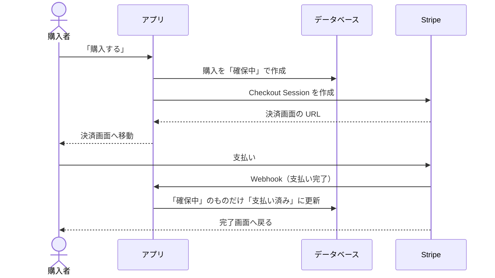
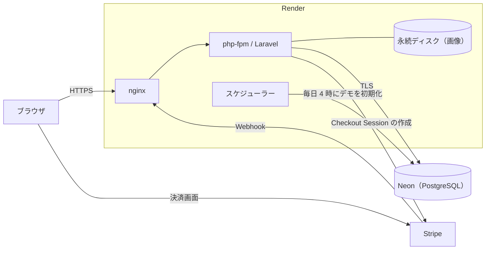
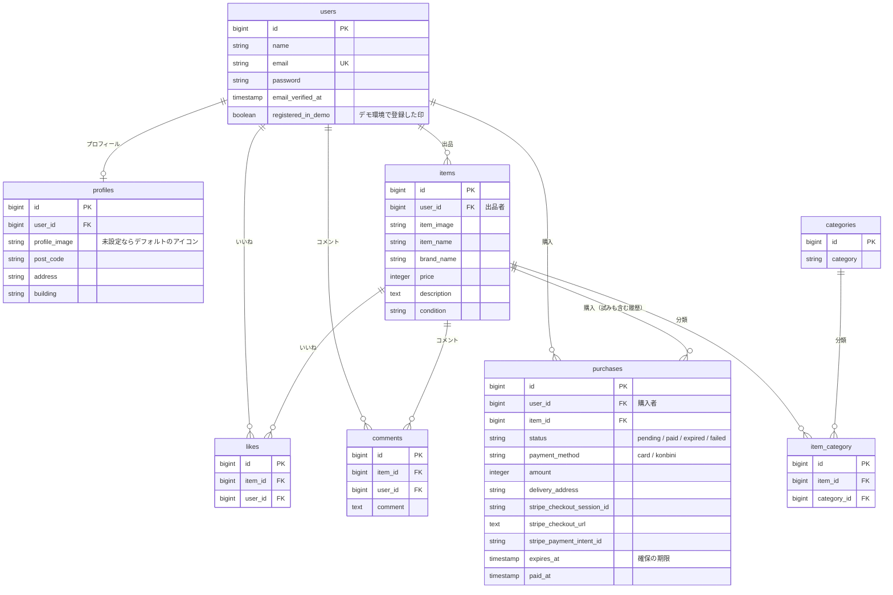

# frea-market

個人どうしで商品を売り買いする、フリマアプリです。

公開 URL：**https://frea-market.onrender.com** （試し方は「[デモ](#デモ)」へ）

## 概要

### どんなアプリか

会員登録した人が、自分の商品を出品し、ほかの人の商品を購入できます。支払いは Stripe を通して行い、カード払いとコンビニ払いに対応しています。

### 誰が何をするか

| 立場 | 流れ |
|---|---|
| 出品者 | 会員登録 → プロフィールの登録 → 商品の出品（画像、カテゴリー、状態、説明、価格）→ マイページで、出品した商品と販売状況を確認 |
| 購入者 | 会員登録 → プロフィールの登録（配送先）→ 商品を探す（一覧、検索、いいね、コメント）→ 支払い方法を選んで購入 → Stripe の画面で支払い → マイページで、購入した商品を確認 |

1 人のユーザーが、出品者にも購入者にもなれます（自分の出品は購入できません）。

### 主な機能

- 会員登録、メール認証、ログイン
- プロフィール（ユーザー名、画像、配送先に使う住所）
- 商品の一覧、商品名での検索、いいねした商品だけのマイリスト
- 商品の詳細、いいね、コメント
- 商品の出品
- 商品の購入（カード払い、コンビニ払い）、購入ごとの配送先の変更
- マイページ（出品した商品、購入した商品）

### 特徴

- **決済は Stripe に任せています。** カード番号などは、このアプリを通りません。
- **購入は、Stripe から届く「支払い完了」の通知で確定します。** 決済のあとに画面を閉じても、あとから入金されるコンビニ払いでも、確定が漏れません。
- **同じ商品が二重に売れません。** 「購入する」を押した時点で商品を確保し、2 人が同時に押しても、確保できるのは 1 人だけです。
- **販売状況が、商品の画像に表示されます。** 支払い済みは「SOLD」、支払い待ちは「取引中」です。支払われずに期限が切れると、販売中に戻ります。

詳しくは「[仕様](#仕様)」に書いています。

## デモ

**https://frea-market.onrender.com**

1. 「デモアカウントでログイン」を押します（入力は不要です）。
2. 商品を選び、「購入手続きへ」から支払い方法を選んで「購入する」を押します。
3. Stripe の決済画面で、テスト用のカード番号 `4242 4242 4242 4242` を入力します（有効期限は未来の日付、セキュリティコードは任意）。
4. 決済が終わると、商品に「SOLD」と表示されます。

- 実際の請求は発生しません（Stripe のテストモードです）。
- 会員登録して試すこともできます。認証メールは送信しないので、架空のメールアドレス（例：yourname@example.com）と、普段使っていないパスワードで登録してください。
- デモのデータは毎日 4:00（日本時間）に初期化されます。購入した商品は販売中に戻り、会員登録したアカウントは削除されます。
- 購入すると、登録したメールアドレスが Stripe のテスト環境に記録されます。
- しばらくアクセスがないと、最初の表示に数秒かかります（データベースが停止状態から起動するためです）。
- コンビニ払いを試す場合の入力は、「[テスト用の入力](#テスト用の入力)」を見てください。

<!-- スクリーンショット 1：商品一覧（docs/images/items.png） -->

## 画面と操作

利用の流れの順に並べています。

### 1. 会員登録（`/register`）

- ユーザー名、メールアドレス、パスワード（8 文字以上、確認用と一致）を入力して登録します。
- 登録したメールアドレスに、認証メールが届きます。メールのボタンを押すと、認証が完了します。認証が済むまでは、認証待ちの画面が表示され、そこから認証メールを再送できます。
- 認証のあと、最初にプロフィール（ユーザー名、郵便番号、住所、建物名、画像）を登録します。登録するまで、ほかの画面は使えません。
- デモ環境では、メール認証を省いています（「[デモ環境](#デモ環境)」）。

### 2. ログイン・ログアウト（`/login`）

- メールアドレスとパスワードでログインします。
- ログアウトは、画面上部のボタンから行います。

### 3. 商品一覧と検索（`/`）

- 「おすすめ」のタブに、すべての商品が並びます。
- 「マイリスト」のタブには、自分がいいねした商品だけが並びます（自分の出品は除きます）。
- 画面上部の検索欄に入力すると、商品名に含まれる文字で絞り込めます。
- 販売中でない商品には、画像に「取引中」か「SOLD」の帯が重なります。
- トップページの一覧はログインが必要です。商品の詳細は、ログインしていなくても見られます。

### 4. 商品詳細（`/item/{id}`）

- 商品の画像、名前、ブランド、価格、説明、カテゴリー、状態と、いいねの数、コメントの数が表示されます。
- **いいね**：ハートのアイコンを押すと、いいねが付きます。もう一度押すと外れます。アイコンは、自分がいいねしていれば赤になります。ログインしていない場合は、ログイン画面に移ります。
- **コメント**：ログインしていると、最新のコメントが表示され、コメント（255 文字まで）を送信できます。
- 販売中の商品には「購入手続きへ」のボタンが表示されます。取引中、SOLD、自分の出品の場合は、ボタンの代わりにその旨が表示されます。

<!-- スクリーンショット 2：商品詳細（docs/images/item-detail.png） -->

### 5. 出品（`/sell`）

- 商品の画像（jpeg / png、5MB まで）、カテゴリー（複数選択可）、商品の状態、商品名、ブランド名（任意）、説明（255 文字まで）、価格（120 円以上）を入力して出品します。

### 6. 購入（`/purchase/{id}`）

1. 支払い方法（カード支払い / コンビニ払い）を選びます。
2. 配送先には、プロフィールの住所が表示されます。「変更する」から、この購入の配送先だけを変更できます（プロフィールの住所は変わりません）。
3. 「購入する」を押すと、商品が確保され、Stripe の決済画面に移ります。
4. 支払いを終えると、完了画面に戻ります。コンビニ払いでは、支払い番号が発行され、支払い方法は Stripe からのメールで案内されます。

- Stripe の決済画面で戻る操作をすると、確保が取り消され、「決済をキャンセルしました」と表示されます。
- 決済の途中で画面を閉じた場合は、もう一度購入画面を開くと「決済を続ける」が表示され、同じ決済画面に戻れます。
- コンビニ払いは、300,000 円までの商品で選べます。

<!-- スクリーンショット 3：購入画面（docs/images/purchase.png） -->

### 7. マイページ（`/mypage`）

- 「出品した商品」のタブに、自分の出品が、販売状況の帯つきで並びます。
- 「購入した商品」のタブに、購入した商品が並びます。支払い待ちの商品には「お支払い待ち」と表示されます。

<!-- スクリーンショット 4：マイページ（docs/images/mypage.png） -->

### 8. プロフィールの変更（`/mypage/profile`）

- ユーザー名、画像（jpeg / png、5MB まで）、郵便番号（`123-4567` の形）、住所、建物名を変更できます。
- 画像を登録していない場合は、既定のアイコンが表示されます。

## 仕様

### 認証

- 会員登録、ログイン、メール認証は、Laravel Fortify を使っています。
- メール認証が済んでいないユーザーは、認証待ちの画面以外を使えません。
- プロフィールを登録していないユーザーは、プロフィールの登録画面に送られます。
- ログインの試行は、メールアドレスと接続元の組み合わせごとに、1 分に 10 回までです。

### 販売状況

商品の販売状況は 3 つです。`items` テーブルに列としては持たず、その商品の購入（`purchases`）から決まります。

| 販売状況 | 条件 | 表示 |
|---|---|---|
| 販売中 | 有効な購入がない | 帯なし。詳細画面に「購入手続きへ」 |
| 取引中 | 期限内の確保（`pending`）がある | 「取引中」 |
| SOLD | 支払い済み（`paid`）の購入がある | 「SOLD」 |

確保が期限を過ぎると、何も更新しなくても、その商品は販売中として扱われます。

### 購入と決済の流れ



- 購入は 4 つの状態を持ちます：確保中（`pending`）、支払い済み（`paid`）、期限切れ（`expired`）、失敗（`failed`）。
- 金額は、リクエストからは受け取らず、商品の価格から決めます。
- 完了画面は、表示するだけです。購入の確定は、Webhook だけが行います。カード払いで Webhook がまだ届いていない場合は、「決済を確認しています」と表示されます。
- 購入できないのは、自分の出品、取引中の商品、SOLD の商品です。詳細画面に戻り、理由が表示されます。

### 同時購入の扱い

- 同じ商品の有効な購入（確保中か支払い済み）は、1 件だけです。PostgreSQL の部分ユニークインデックスで保証しています。
- 2 人が同時に「購入する」を押した場合、片方の確保はデータベースに弾かれ、「他の方が購入手続き中です。」と表示されます。
- どの書き込みも 1 文で完結させ、トランザクションなしで整合性を保っています。

### 配送先

- 配送先は、プロフィールの住所です。購入画面の「変更する」で入力した住所は、その商品の購入にだけ使います。プロフィールは書き換えず、ほかの商品の購入にも使いません。
- 変更した住所は、セッションに商品ごとに保持します。決済のあと完了画面に戻ると消えます。決済をキャンセルしたときや、決済を開始できなかったときは残るので、やり直しても同じ配送先になります。
- 配送先は、「購入する」を押して商品を確保した時点で、購入に記録します。画面から送られた値は使わず、サーバー側でセッションかプロフィールから決めます。確保中の購入の配送先は、変更できません。
- 変更画面では、郵便番号（`123-4567` の形）、住所、建物名（それぞれ 100 文字まで）の 3 つが必須です。

### 支払い期限

| 支払い方法 | 期限 | 期限が切れたとき |
|---|---|---|
| カード払い | 決済画面を開いてから 30 分 | 確保が切れ、販売中に戻る |
| コンビニ払い | 支払い番号の発行から 3 日後の 23:59 | 購入は「失敗」になり、販売中に戻る |

- コンビニ払いの間、商品は「取引中」です。
- 期限切れの確保は、次に誰かがその商品を購入しようとしたときに「期限切れ」に更新します（定期的な掃除はしていません）。

### Webhook

- Stripe からの通知は `POST /stripe/webhook` で受け取ります。署名を検証し、不正なものは 400 で拒否します。
- 受け取るイベントは 4 つです：`checkout.session.completed`、`checkout.session.async_payment_succeeded`、`checkout.session.async_payment_failed`、`checkout.session.expired`。
- 状態の更新は、「確保中のものだけ」という条件を付けています。同じ通知が重複して届いても、二重には更新されません。
- 確保が期限切れになったあとに支払い完了が届いた場合は、支払い済みにはせず、エラーとして記録します（自動では返金しません）。支払われた金額が購入の金額と違う場合も、記録します。

### 出品

- 価格は 120 円以上です（Stripe のコンビニ払いの下限に合わせています）。上限はありません。
- コンビニ払いを選べるのは、300,000 円までの商品です（Stripe のコンビニ払いの上限）。

### いいね

- いいねは、1 人につき 1 商品 1 件です。`likes` テーブルのユニークインデックスで保証していて、同時に届いたリクエストでも重複しません。
- いいねの数は、`likes` から数えます。
- 追加は `POST /like/{id}`、削除は `DELETE /like/{id}` です。送信中は次の操作を受け付けず、表示はサーバーの応答で更新します。

### 画像

- 商品とプロフィールの画像は、Laravel のファイルストレージ（`IMAGE_DISK`、既定は `public`）に、ランダムなファイル名で保存します。
- CSS・JavaScript・固定の画像の URL には、ファイルの更新時刻を付けています。ファイルを差し替えると URL が変わり、ブラウザの古いキャッシュが使われません。

### デモ環境

環境変数 `DEMO_MODE` を `true` にすると、公開デモ用の動きになります。既定は無効で、ローカルでは通常の動きです。

| 項目 | デモ環境での動き |
|---|---|
| ログイン画面 | 「デモアカウントでログイン」のボタンが表示される。押すと、デモアカウントで通常のログインが行われる |
| 会員登録 | メール認証を省き、登録後すぐに使える。認証メールは送信しない |
| シードのユーザー | ログインできない（パスワードが、このリポジトリで公開されているため） |
| 登録の回数 | 同じ IP アドレスから、1 時間に 5 回まで |
| 登録できる人数 | デモ環境で登録したユーザーは、100 人まで |
| 出品数 | デモ環境で登録したユーザーは 5 件まで、デモアカウントは 20 件まで |

### デモの初期化

デモ環境では、毎日 4:00（日本時間）と、デプロイのたびに、次のものを初期状態に戻します。

- **デモアカウント**：購入、いいね、コメント、出品を削除し、プロフィールを初期値に戻します。
- **デモ環境で登録したユーザー**：同じものを削除したうえで、ユーザーごと削除します。
- **残すもの**：支払い待ちの購入は、あとから入金の通知が届くので残します。それが付いている出品と、そのユーザーも残し、片付いたあとの初期化で削除します。

削除する対象は、登録のときに付けた印（`users.registered_in_demo`）で決めます。印のないユーザー（シードのユーザーや、デモ環境でないときに登録したユーザー）は、削除しません。

## 技術構成

| 種類 | 内容 |
|---|---|
| 言語・フレームワーク | PHP 8.1、Laravel 8.83、Laravel Fortify 1.19 |
| データベース | PostgreSQL 15 |
| 決済 | Stripe Checkout、stripe-php 21.3 |
| テスト | PHPUnit 9.6 |
| ローカル環境 | Docker Compose（nginx 1.21、php-fpm、PostgreSQL、MailHog、Adminer） |
| 本番環境 | Render（Docker、永続ディスク）、Neon（PostgreSQL） |



## ER 図



- `likes` は `(item_id, user_id)` がユニークです。
- `purchases` は、`item_id` に「`status` が `pending` か `paid` のものだけ」を対象にした部分ユニークインデックスがあります。
- 商品の販売状況（販売中 / 取引中 / SOLD）は列として持たず、`purchases` から判定します。
- `created_at` と `updated_at`、セッション用の `sessions` テーブルは省いています。

## ローカルでの環境構築

Docker と Docker Compose が必要です。Windows では、WSL2 のファイルシステムにクローンしてください（Windows 側のフォルダをマウントすると、動作が遅くなります）。

```
git clone -b portfolio git@github.com:oxnut134/frea-market.git
cd frea-market
docker compose up -d --build

cp src/.env.example src/.env
docker compose exec php composer install
docker compose exec php php artisan key:generate

docker compose exec php chown -R www-data:www-data storage bootstrap/cache
docker compose exec php chmod -R ug+rwX storage bootstrap/cache

docker compose exec php php artisan migrate --seed
docker compose exec php php artisan storage:link
docker compose exec php chown -R www-data:www-data storage/app/public
```

| URL | 内容 |
|---|---|
| http://localhost | アプリ |
| http://localhost:8025 | MailHog（送信されたメールの確認） |
| http://localhost:8080 | Adminer（データベースの確認） |

- `.env.example` の DB とメールの設定は、Docker Compose の構成に合わせてあります。そのままで動きます。
- 最後の `chown` は、シーディング（root で実行）がコピーした画像のフォルダに、アプリ（www-data）から書き込めるようにするものです。実行しないと、画像のアップロードが 500 エラーになります。
- シーディングで、4 人のユーザー、デモアカウント、10 個の商品が入ります。
- 画像アップロードの上限は 5MB です。`docker/php/php.ini` を変えた場合は、`docker compose build php && docker compose up -d php` で作り直してください。

### メール認証

会員登録すると、認証メールが MailHog に届きます。http://localhost:8025 でメールを開き、「メールアドレス確認」のボタンを押すと認証が完了し、プロフィールの登録画面に進みます。

### Stripe の設定

`src/.env` に、テストモードのキーを設定します。

```
STRIPE_PUBLIC_KEY={公開可能キー（pk_test_...）}
STRIPE_SECRET_KEY={シークレットキー（sk_test_...）}
STRIPE_WEBHOOK_SECRET={Webhook の署名シークレット（whsec_...）}
```

購入の確定は、Stripe から届く Webhook（`POST /stripe/webhook`）で行います。Webhook が届かないと、購入は「取引中」のまま完了しません。Stripe からローカルの環境には直接届かないので、[Stripe CLI](https://docs.stripe.com/stripe-cli) で転送します。

1. Stripe にログインします（ブラウザで認証）。

   ```
   stripe login
   ```

2. Webhook をローカルへ転送します。確認の間は、実行したままにします。

   ```
   stripe listen --forward-to http://localhost/stripe/webhook
   ```

3. 起動時に表示される `whsec_...` を、`.env` の `STRIPE_WEBHOOK_SECRET` に設定します。

4. 設定を読み直します。

   ```
   docker compose exec php php artisan config:clear
   ```

- `STRIPE_WEBHOOK_SECRET` が未設定、または値が違う場合、Webhook はすべて 400（署名エラー）になります。
- 転送されたイベントと応答コードは、`stripe listen` の画面に表示されます。
- コンビニ払いを使うには、Stripe ダッシュボードの「設定 → 決済手段」で、コンビニ決済を有効にします。

### テスト用の入力

- カード払い：カード番号 `4242 4242 4242 4242`、有効期限は未来の日付、セキュリティコードは任意。
- コンビニ払い：決済画面の確認番号に次の値を入れると、結果を切り替えられます。

| 確認番号 | 結果 |
| --- | --- |
| `22222222220` | すぐに入金される（SOLD になる） |
| `11111111110` | 3 分後に入金される（その間は「取引中」） |
| `33333333330` | すぐに期限切れになる（販売中に戻る） |

### デモ用の表示をローカルで確かめる

`src/.env` に `DEMO_MODE=true` を足すと、ログイン画面に「デモアカウントでログイン」が表示され、会員登録でメール認証が省かれ、シードのユーザーはログインできなくなります。既定は無効です。

## テスト

テスト用のデータベースを一度だけ作ってから、実行します。

```
docker compose exec pgsql createdb -U laravel_user frea_test
docker compose exec php php artisan test
```

245 件あります（ほかに、仕様の確認待ちで skip にしているものが 1 件）。データベースは PostgreSQL を使い、決済のテストは Stripe に接続せず、偽の HTTP クライアントと、署名を付けた Webhook を使います。

| 対象 | 確かめていること |
|---|---|
| 認証 | 会員登録とログインの入力エラー、メール認証、プロフィールを登録するまで使えないこと |
| 商品 | 一覧、マイリスト、検索、詳細の表示、出品と入力エラー、画像の保存と URL |
| いいね・コメント | 追加と削除、重複しないこと、未ログインでは使えないこと、コメントの入力エラー |
| 購入と決済 | 商品の確保、決済画面への移動、キャンセル、同時購入、支払い方法、配送先の変更、完了画面、販売状況の判定 |
| Webhook | 署名の検証、4 つのイベントの処理、重複して届いた場合、期限切れのあとの支払い、金額の不一致 |
| マイページ | 出品した商品と購入した商品の表示、プロフィールの変更 |
| デモ環境 | ボタンと案内の表示、登録時のメール認証の省略、シードのユーザーのログイン拒否、登録と出品の上限、初期化で消すものと残すもの |
| 本番の設定 | セッションの保存、データベースの暗号化接続、エラーの記録に入力値が出ないこと、`robots.txt` |

## 本番の構成

| 役割 | サービス | 設定 |
|---|---|---|
| Web | [Render](https://render.com/)（Docker） | Starter、シンガポール。nginx・php-fpm・スケジューラーを 1 つのコンテナで動かす（supervisord） |
| 画像 | Render の永続ディスク | 1 GB。`storage/app/public` にマウント |
| データベース | [Neon](https://neon.com/)（無料プラン） | PostgreSQL 15、シンガポール。暗号化接続（`sslmode=require`） |
| 決済 | Stripe（テストモード） | Webhook エンドポイントは `/stripe/webhook` |

設定は、ルートの `Dockerfile`、`render.yaml`、`docker/render/` にあります。

### 起動時の処理（`docker/render/entrypoint.sh`）

1. `APP_KEY` が設定されていなければ、起動を止めます。
2. マイグレーションを実行します。失敗したら、起動を止めます。
3. シーディングと、デモの初期化を実行します。失敗しても、起動は続けます。
4. 設定・ルート・ビューをキャッシュし、nginx・php-fpm・スケジューラーを起動します。

### 環境変数

固定の値は `render.yaml` に書いてあります。次の 6 つは、Render のダッシュボードで入力します。

| 名前 | 内容 |
|---|---|
| `APP_KEY` | 手元で `php artisan key:generate --show` を実行して得た値 |
| `APP_URL` | 公開 URL。画像の URL はここから作られます |
| `DATABASE_URL` | Neon の接続文字列（`-pooler` の付かない、直接接続のもの） |
| `STRIPE_PUBLIC_KEY` | Stripe の公開可能キー |
| `STRIPE_SECRET_KEY` | Stripe のシークレットキー |
| `STRIPE_WEBHOOK_SECRET` | Stripe に登録した Webhook エンドポイントの署名シークレット |

### Stripe の Webhook エンドポイント

Stripe ダッシュボードで、`https://{公開 URL}/stripe/webhook` を登録します。

- 受信するイベント：`checkout.session.completed`、`checkout.session.async_payment_succeeded`、`checkout.session.async_payment_failed`、`checkout.session.expired`
- API バージョン：登録時に選べた `2025-05-28.basil` を使っています（カード払いで動作を確認済み）。

### デモの初期化の実行

`php artisan demo:reset` が、デモアカウントの購入・いいね・コメント・出品・プロフィールを初期状態に戻し、デモ環境で登録したアカウントをデータごと削除します。デプロイのたびと、毎日 4:00（日本時間）に実行されます。実行すると、ログに `Demo data was reset` と出ます。`DEMO_MODE` が無効のときは、何もしません。

### 無料枠と制約

- Neon の無料プランは、5 分アクセスがないとデータベースを停止し、次のアクセスで自動的に起動します。月の計算時間に上限があるので、ヘルスチェック（`/healthz`）と `robots.txt` は、データベースに触れないようにしています。
- 永続ディスクがあるので、デプロイのたびに短い停止があります。
- リポジトリのシード画像を差し替えても、ディスクに同じ名前の画像があればコピーされません。差し替えるときは、ディスク上の古い画像を消してからデプロイします。

## 既知の点

- **Laravel 8 はサポートが終了しています。** Laravel 8 に由来する勧告を 5 件残しています。このアプリでの影響は 1 件ずつ確認してあり、内容と理由は [docs/dependency-advisories.md](docs/dependency-advisories.md) にまとめています。
- **本番ではメールを送信していません**（`MAIL_MAILER=log`）。そのため、デモ環境では会員登録のメール認証を省いています。メール認証そのものは実装してあり、ローカルでは MailHog で確かめられます。
- 出品を取り消す機能、パスワードを変更する機能はありません。
- 商品詳細に表示されるコメントは、最新の 1 件です。
- 画像を保存したあとに DB への登録が失敗すると、画像のファイルが残ります。
- 存在しない商品の詳細画面を開くと、404 ではなく 500 になります。
- 商品一覧とマイページは並び順を指定しておらず、表示順が変わることがあります。

---

画面と機能の範囲は、COACHTECH の模擬案件の仕様書をもとにしています。
